# Disk Usage Monitor Bash Script

A Bash script that monitors disk space usage across all filesystems, logs the results to a file, and alerts when usage exceeds a configurable threshold.

---

## 📊 Features

- **Real-time Monitoring:** Checks disk usage across all mounted filesystems
- **Configurable Threshold:** Set your own usage percentage warning level
- **Detailed Logging:** Saves all results with timestamps to a log file
- **Warning System:** Alerts when any filesystem exceeds the usage threshold
- **Human-readable:** Output is formatted for easy reading
- **Portable:** Uses standard Unix tools available on all Linux/macOS systems

---

## 🛠️ Configuration

Edit these variables at the top of `disk_usage.sh`:

```bash
#!/bin/bash

USAGE=80                           # Warning threshold percentage
LOG_FILE="$HOME/Documents/disk_usage.txt"  # Log file location
DATE=$(date '+%Y-%m-%d %H:%M:%S')  # Timestamp format
```

---

## 💻 Usage

### 1️⃣ Make the script executable
```bash
chmod +x disk_usage.sh
```

### 2️⃣ Run the script
```bash
./disk_usage.sh
```

### 3️⃣ (Recommended) Schedule with cron for automated monitoring
```bash
# Run every 6 hours
0 */6 * * * /path/to/disk_usage.sh

# Run daily at 9 AM
0 9 * * * /path/to/disk_usage.sh

# Run every Sunday at midnight
0 0 * * 0 /path/to/disk_usage.sh
```

---

## 📝 Example Output

### Terminal Output:
```
Filesystem: /dev/sda1, Usage: 45%, Mounted on: /
Filesystem: /dev/sdb1, Usage: 92%, Mounted on: /home
WARNING: /dev/sdb1 on /home is 92% full!
Filesystem: tmpfs, Usage: 1%, Mounted on: /dev/shm
```

### Log File (`$HOME/Documents/disk_usage.txt`):
```
Disk Usage Check at 2024-01-05 14:30:00
---------------------------------
Filesystem: /dev/sda1, Usage: 45%, Mounted on: /
Filesystem: /dev/sdb1, Usage: 92%, Mounted on: /home
WARNING: /dev/sdb1 on /home is 92% full!
Filesystem: tmpfs, Usage: 1%, Mounted on: /dev/shm
```

---

## 🔧 How It Works

1. **Get Current Date:** `DATE=$(date '+%Y-%m-%d %H:%M:%S')`
2. **Write Header:** Timestamp to log file
3. **List Filesystems:** `df -h` shows disk usage in human-readable format
4. **Parse Output:** `awk` extracts filesystem name, usage percentage, and mount point
5. **Check Each FS:** Loop through all filesystems
6. **Remove '%':** `usep="${usage%\%}"` converts "92%" to "92"
7. **Log Entry:** Write each filesystem's status to log
8. **Check Threshold:** If usage ≥ `USAGE`, show warning
9. **Add Spacing:** Blank line for readability in log

---

## 📊 Understanding `df` Output

The script parses this `df -h` output:
```
Filesystem      Size  Used Avail Use% Mounted on
/dev/sda1        20G   15G  4.3G  78% /
/dev/sdb1       100G   85G   15G  85% /home
tmpfs           3.9G     0  3.9G   0% /dev/shm
```

The script extracts:
- **Column 1:** Filesystem (`/dev/sda1`)
- **Column 5:** Usage percentage (`78%`)
- **Column 6:** Mount point (`/`)

---

## ⚙️ Technical Details

### Key Commands:
- `df -h`: Disk free in human-readable format
- `awk 'NR>1 {print $1, $5, $6}'`: Skip header row, print columns 1, 5, 6
- `"${usage%\%}"`: Remove trailing '%' character
- `tee -a $LOG_FILE`: Display AND append to log file
- `[ "$usep" -ge "$USAGE" ]`: Compare integers (greater than or equal)

### Script Logic Flow:

```mermaid
graph TD
    A[Start Script] --> B[Set Variables]
    B --> C[Write Log Header]
    C --> D[Get df -h Output]
    D --> E[Parse with awk]
    E --> F{Loop Through<br>Each Filesystem}
    F --> G[Remove % Symbol]
    G --> H[Log Filesystem Info]
    H --> I{Usage ≥ Threshold?}
    I -->|Yes| J[Show Warning]
    I -->|No| K[Continue]
    J --> K
    K --> F
    F -->|Loop Complete| L[Add Blank Line]
    L --> M[End Script]
```


---

## 🔄 Customization Options

### Change Warning Threshold:
```bash
# For more aggressive warnings
USAGE=70

# For more relaxed monitoring
USAGE=90
```

### Change Log Location:
```bash
# System-wide logging
LOG_FILE="/var/log/disk_usage.log"

# Desktop notification
LOG_FILE="$HOME/Desktop/disk_log.txt"

# Multiple logs with rotation
LOG_FILE="$HOME/Documents/disk_usage_$(date +%Y-%m).txt"
```

### Add Email Notifications:
```bash
# Add after warning message
if [ "$usep" -ge "$USAGE" ]; then
    echo "WARNING: $filesystem on $mountpoint is ${usep}% full!" | tee -a "$LOG_FILE"
    echo "ALERT: High disk usage on $filesystem" | mail -s "Disk Alert" admin@example.com
fi
```

### Exclude Specific Filesystems:
```bash
# Skip tmpfs and loop devices
df -h | grep -v 'tmpfs\|loop' | awk 'NR>1 {print $1, $5, $6}' | while read ...
```

---

## 📈 Advanced Usage

### 1. Create Daily Reports:
```bash
# Run daily and keep 30 days of logs
0 0 * * * /path/to/disk_usage.sh
# Then add to crontab to clean old logs:
0 1 * * * find $HOME/Documents/ -name "disk_usage_*.txt" -mtime +30 -delete
```

### 2. Monitor Specific Mount Points:
```bash
# Only monitor / and /home
df -h / /home | awk 'NR>1 {print $1, $5, $6}' | while read ...
```

### 3. Add Color Output:
```bash
# Color codes
RED='\033[0;31m'
GREEN='\033[0;32m'
NC='\033[0m' # No Color

if [ "$usep" -ge "$USAGE" ]; then
    echo -e "${RED}WARNING: $filesystem on $mountpoint is ${usep}% full!${NC}" | tee -a "$LOG_FILE"
fi
```

---

## ⚠️ Common Issues & Solutions

### 1. **Permission Denied for Log File**
```bash
# Check permissions
ls -la $HOME/Documents/

# Fix permissions
chmod 644 $HOME/Documents/disk_usage.txt
```

### 2. **Script Not Executable**
```bash
# Make executable
chmod +x disk_usage.sh

# Check if it's executable
ls -l disk_usage.sh
# Should show: -rwxr-xr-x
```

### 3. **`df` Shows Different Output**
```bash
# Test df output on your system
df -h

# Adjust awk columns if needed
df -h | awk '{print $1, $5, $6}'  # Your system might have different column order
```

---

## 📚 Dependencies

- **Bash** (version 3.2+)
- **coreutils** (`df`, `date`, `echo`)
- **awk** (usually pre-installed)

No special packages needed!

---

## 🎯 Use Cases

- **System Administrators:** Monitor server disk space
- **Developers:** Prevent CI/CD pipelines from failing due to disk space
- **Personal Use:** Keep track of home directory usage
- **Servers:** Automated monitoring for web/app servers
- **Backup Systems:** Ensure backup destinations have enough space

---

## 🤝 Contributing

Feel free to extend this script with:
- Email/SMS notifications
- Slack/Discord webhook integration
- Automatic cleanup suggestions

---

## 📁 Project Structure
```
folder-disk-monitor/   # Suggested folder name
├── disk_usage.sh      # Main script
└── README.md          # This documentation
```

---

## 🔍 Testing the Script

```bash
# Test with verbose output
bash -x disk_usage.sh

# Check log file
tail -f $HOME/Documents/disk_usage.txt

# Simulate high usage (for testing only)
USAGE=5  # Set threshold very low
./disk_usage.sh  # Should trigger warnings
```

---

